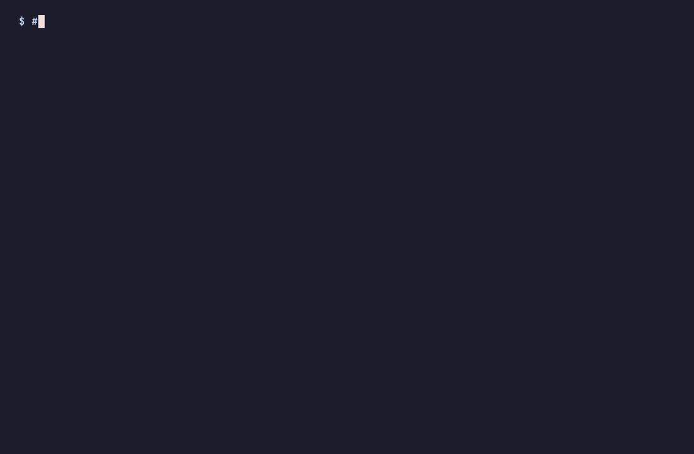
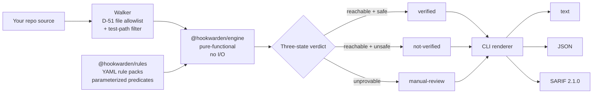
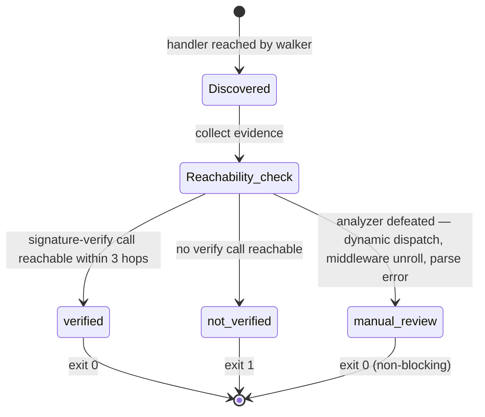

<p align="center">
  
</p>

<p align="center">
  <strong>The only scanner laser-focused on webhook signature verification.</strong><br />
  Local. Deterministic. Zero-network. JS/TS + Python + PHP. Five minutes from <code>npx</code> to fix.
</p>

<p align="center">
  <a href="https://www.npmjs.com/package/hookwarden"></a>
  <a href="https://www.npmjs.com/package/hookwarden"></a>
  <a href="https://pypi.org/project/hookwarden/"></a>
  <a href="./LICENSE"></a>
  
  <a href="https://github.com/Hookwarden/hookwarden/actions/workflows/ci.yml"></a>
  <a href="https://github.com/Hookwarden/hookwarden/stargazers"></a>
  
</p>

<p align="center">
  
</p>

```bash
npx hookwarden scan ./your-app
```

No traffic leaves your machine. No telemetry. No SaaS sign-up required.

---

## 📚 Contents

- [💡 Why](#-why)
- [📦 Install](#-install)
- [🚀 Quickstart](#-quickstart)
- [📺 Real output](#-real-output)
- [🌐 Languages & frameworks](#-languages--frameworks)
- [🔐 Provider coverage](#-provider-coverage)
- [🤖 CI integration](#-ci-integration)
- [🏗 Architecture](#-architecture)
- [🆚 vs. other tools](#-vs-other-tools)
- [🛠 Advanced usage](#-advanced-usage)
- [🗺 Roadmap](#-roadmap)
- [🤝 Contributing](#-contributing)
- [⭐ Star history](#-star-history)
- [📄 License](#-license)

---

## 💡 Why

**Every dollar of fraud loss that flows through a webhook starts with a verification bug — and verification bugs hide in plain sight.**

A handler that accepts an unsigned payload, compares HMACs with `==`, or skips the signature check on a `?test=true` path will silently route attacker traffic into your business logic. The bug is one line of code in a 50K-line app, and the code looks plausible — not the shape general-purpose SAST tools are tuned to flag. They were built to catch SQL injection and prototype pollution; webhook verification falls between their default rule packs.

Hookwarden does one thing. It walks your repo, parses every webhook handler across 11 frameworks (Express, Hono, Fastify, Next.js, Flask, FastAPI, Django, Laravel, Symfony, Slim, and vanilla-PHP), and labels each one **verified**, **not-verified**, or **manual-review** — with the exact file, line, and a fix drawn verbatim from provider documentation. The provider catalog (Stripe, GitHub, Shopify, Slack, Twilio, Square — and growing) encodes signature-format quirks no generic scanner has the surface area to know: Stripe uses HMAC-SHA256 with a 5-minute timestamp tolerance; Slack uses `v0:${ts}:${body}` not raw-body; Twilio is the SHA1 outlier the rest of the catalog has to accommodate.

**The three-state verdict is not a hedge.** `manual-review` is what you get when hookwarden can't prove safety or unsafety from the source alone — a handler inside a middleware chain that the analyzer couldn't fully unroll, for example. It's how the false-positive rate stays honest. A tool that reports every gray area as a bug is not a security tool; it's noise.

---

## 📦 Install

```bash
npx hookwarden scan .   # works everywhere, no install
```

Or install natively via your OS package manager:

| OS | Recommended | Alternates |
|---|---|---|
| **Linux** | `brew install Hookwarden/tap/hookwarden` | `npm i -g hookwarden` · `pip install hookwarden` · direct binary |
| **macOS** | `npm i -g hookwarden` | `npx hookwarden` (no install) |
| **Windows** | `scoop bucket add hookwarden https://github.com/Hookwarden/scoop-bucket && scoop install hookwarden` | `npm i -g hookwarden` · `pip install hookwarden` |

> Windows users downloading the `.exe` directly from a GitHub release will see a SmartScreen "Windows protected your PC" warning on first launch — hookwarden binaries ship intentionally unsigned. Click `More info → Run anyway`, or use **Scoop / WinGet / npm / pip** instead — each verifies the artifact by SHA-256 before exec, no SmartScreen friction. macOS users: use Homebrew or `npx`; no signed macOS binary ships.

Node 22+ is required for the npm/`npx` path. The standalone binaries (Linux x64/arm64, Windows x64) bundle the Node runtime.

---

## 🚀 Quickstart

**First use — no install required:**
```bash
npx hookwarden scan ./your-app
```

**Make CI fail on high+ findings:**
```bash
npx hookwarden scan ./your-app --fail-on high --format json
# Exit codes: 0 clean · 1 findings at threshold · 2 engine error · 3 config error · 4 parse coverage below floor.
# JSON envelope is byte-stable — diff-safe between PRs.
```

**PR-scoped scan + CI gate (default branch = origin/main):**
```bash
npx hookwarden scan ./your-app \
  --diff-only \
  --diff-base origin/main \
  --fail-on high
```

**Upload to GitHub Code Scanning (findings show in the Security tab):**
```bash
npx hookwarden scan ./your-app --format sarif > findings.sarif
gh api -X POST /repos/$REPO/code-scanning/sarifs \
  -F sarif=@findings.sarif -F ref=$GITHUB_REF
# SARIF round-trips through GitHub Code Scanning; re-upload deduplicates
# via `partialFingerprints` so the same finding doesn't surface twice.
```

**Non-greenfield adoption — accept existing findings, gate only NEW ones:**
```bash
# One-time: capture the current state as a baseline (written to .hookwarden.baseline.json).
npx hookwarden scan ./your-app --baseline write
git add .hookwarden.baseline.json && git commit -m "chore: hookwarden baseline"

# All subsequent scans auto-read the baseline; only new findings are reported.
npx hookwarden scan ./your-app --fail-on high
```

**List every detected webhook handler (no rule evaluation):**
```bash
npx hookwarden inventory ./your-app
# Useful for compliance audits — "what webhook handlers exist in this codebase
# and which provider/framework does each route to?". No rules run; just inventory.
```

**Repo-level config via `hookwarden.config.yaml`:**
```bash
# Auto-discovered when placed at the repo root; or pass explicitly:
npx hookwarden scan ./your-app --config ./hookwarden.config.yaml

# Precedence: CLI flag > HOOKWARDEN_<KEY> env var > config file > built-in default.
```

**Strict suppressions (compliance teams):**
```bash
npx hookwarden scan ./your-app --strict-suppressions
# Stale inline `// hookwarden-ignore-next-line` suppressions promote to ERRORS
# instead of warnings. Forces audit hygiene: a fix that removes the bug must also
# remove its suppression — otherwise CI breaks.
```

**Tune parse-coverage floor (for noisy / generated-code repos):**
```bash
npx hookwarden scan ./your-app --min-parse-coverage 0.85
# Default 0.95. Lower for monorepos with generated TS / JSX edge cases where
# the parser occasionally bails. Below this floor, the scanner exits 4 — by design.
```

See [Install](#-install) for permanent install via npm, Homebrew, Scoop, or PyPI. Full flag reference: `npx hookwarden --help`.

---

## 📺 Real output

**Clean scan — exits 0:**

```
hookwarden scan ./your-app

✓  Scanned 24 candidates · 24 parsed (100.0% coverage) · 0 findings
```

**Scan with a bug — exits 1:**

```
hookwarden scan ./your-app

CRITICAL
────────

  server.js:10:1
    stripe/express-middleware-ordering  [not-verified]
    Express webhook handler for Stripe has `express.json()` registered before
    the webhook route. JSON middleware consumes the request body; by the time
    the Stripe handler runs, the raw bytes used for HMAC are gone.

    Fix: register `express.json()` AFTER the webhook route, OR mount
    `express.raw({ type: 'application/json' })` only on the webhook path.
    ↳ https://stripe.com/docs/webhooks/signatures

HIGH
────

  handlers/slack.ts:34:1
    slack/missing-timestamp-validation  [not-verified]
    Slack handler does not enforce the 5-minute replay window. The
    `X-Slack-Request-Timestamp` header is present but not compared against
    the current time before signature verification proceeds.

    Fix: reject requests where abs(Date.now()/1000 - ts) > 300 before
    computing the `v0:${ts}:${body}` signing string.
    ↳ https://api.slack.com/authentication/verifying-requests-from-slack

────────────
Found 1 critical · 1 high · 0 medium · 0 low · 0 info · 0 manual-review
Scanned in 0.3 s · 24 / 24 candidates parsed (100.0% coverage)
```

**JSON envelope shape:**

```json
{
  "schema_version": "1.0",
  "engine": { "version": "0.3.1", "commit_sha": null },
  "rule_pack": { "version": "0.3.1", "content_hash": "51c219..." },
  "scan": {
    "counts": {
      "active":     { "critical": 1, "high": 1, "medium": 0, "low": 0, "info": 0 },
      "suppressed": { "critical": 0, "high": 0, "medium": 0, "low": 0, "info": 0 }
    },
    "findings": [
      {
        "rule_id": "stripe/express-middleware-ordering",
        "severity": "critical",
        "state": "not-verified",
        "provider": "stripe",
        "file_path": "server.js",
        "location": { "line": 10, "col": 1 },
        "finding_id": "stripe/express-middleware-ordering@d603a04...",
        "primary_location_line_hash": "d603a04...",
        "message": "Express webhook handler for Stripe has...",
        "redacted_snippet": "app.use(express.json())\napp.post('/webhook', ...",
        "suppressed": null
      }
    ],
    "scanned_at": "2026-05-05T18:31:33.653Z",
    "parsed_files_count": 1,
    "parse_candidates_count": 1
  },
  "suppressions": { "applied": [], "stale": [] }
}
```

Sorted keys, schema-versioned, byte-stable across runs (modulo `scanned_at`). SARIF output round-trips through GitHub Code Scanning and deduplicates via `partialFingerprints` on re-upload.

---

## 🌐 Languages & frameworks

3 languages, 11 frameworks, 1 codebase walker. PHP and Python use `tree-sitter`; JS/TS use Babel. Single-file vanilla-PHP handlers are detected heuristically; everything else routes through framework-specific adapters.

| Language | Frameworks | Parser |
|---|---|---|
| **JavaScript / TypeScript** | Express · Hono · Fastify · Next.js | `@babel/parser` |
| **Python** | Flask · FastAPI · Django | `tree-sitter-python` (WASM) |
| **PHP** (v0.4) | Laravel · Symfony · Slim · vanilla-PHP single-file | `tree-sitter-php` (WASM) |

PHP 8.0+ syntax floor. Python 3.10+ recommended. TypeScript: strict + non-strict both supported.

---

## 🔐 Provider coverage

45 rules across 6 providers, each applicable across the relevant subset of the 11 frameworks above. Every rule carries fix guidance quoted verbatim from the provider's canonical security documentation.

<p align="center">
  <a href="./packages/rules/rules/stripe"></a>&nbsp;&nbsp;&nbsp;
  <a href="./packages/rules/rules/github"></a>&nbsp;&nbsp;&nbsp;
  <a href="./packages/rules/rules/shopify"></a>&nbsp;&nbsp;&nbsp;
  <a href="./packages/rules/rules/slack"></a>&nbsp;&nbsp;&nbsp;
  <a href="./packages/rules/rules/twilio"></a>&nbsp;&nbsp;&nbsp;
  <a href="./packages/rules/rules/square"></a>
</p>

| Provider | Rules | Detection types | Custom predicate |
|---|---|---|---|
| [**Stripe**](./packages/rules/rules/stripe) | 9 | missing-sig-verif, timing-unsafe, raw-body, missing-timestamp, wrong-hmac, unreachable-verif, hardcoded-secret (`whsec_`), library-verified | — |
| [**GitHub**](./packages/rules/rules/github) | 9 | missing-sig-verif, timing-unsafe, raw-body, missing-timestamp, wrong-hmac, unreachable-verif, hardcoded-secret (`ghs_`, `github_pat_`), library-verified | — |
| [**Shopify**](./packages/rules/rules/shopify) | 7 | missing-sig-verif, timing-unsafe, raw-body, missing-timestamp (info), wrong-hmac, unreachable-verif, library-verified | — |
| [**Slack**](./packages/rules/rules/slack) | 7 | missing-sig-verif, timing-unsafe, raw-body, missing-timestamp (high), wrong-hmac, unreachable-verif, library-verified | Parameterized `timestamp_dot_body` recipe |
| [**Twilio**](./packages/rules/rules/twilio) | 7 | missing-sig-verif, timing-unsafe, raw-body, missing-timestamp (info), wrong-hmac, unreachable-verif, library-verified | `predicates/custom/twilio-signing.ts` — URL+sorted-params canonical-string + HMAC-SHA1 |
| [**Square**](./packages/rules/rules/square) | 6 | missing-sig-verif, timing-unsafe, raw-body, wrong-hmac, unreachable-verif, library-verified | Parameterized `custom_field_tuple` recipe |

Full per-rule applicability matrix: [`docs/rule-coverage.md`](./docs/rule-coverage.md).

---

## 🤖 CI integration

### GitHub Action (recommended)

```yaml
# .github/workflows/hookwarden.yml
name: hookwarden
on: [pull_request, push]
permissions:
  contents: read
  pull-requests: write
  security-events: write
jobs:
  scan:
    runs-on: ubuntu-latest
    steps:
      - uses: actions/checkout@v4
        with: { fetch-depth: 0 }
      - uses: Hookwarden/hookwarden-action@v1
        with:
          fail-on: high
```

Uploads SARIF to Code Scanning automatically. Findings appear as PR annotations.

### Raw CLI + SARIF upload

```yaml
- uses: actions/setup-node@v4
  with: { node-version: '22' }
- run: npx hookwarden scan . --format sarif > hookwarden.sarif
- uses: github/codeql-action/upload-sarif@v3
  with:
    sarif_file: hookwarden.sarif
```

SARIF severity mapping: `critical`/`high` → `error` · `medium` → `warning` · `low`/`info` → `note`.

---

## 🏗 Architecture

hookwarden is a pnpm monorepo with three load-bearing packages and a strict dependency boundary enforced in CI.



The verdict-state machine is the architectural contract — every finding lives in exactly one of these states, and the false-positive rate stays honest by routing analysis-defeated cases to `manual-review` rather than guessing:



| Package | Purpose | License |
|---|---|---|
| [`@hookwarden/engine`](./packages/engine) | Webhook handler discovery, reachability analysis, evidence collection. Pure-functional, browser-safe — no I/O, no filesystem, no network. | Apache 2.0 |
| [`@hookwarden/rules`](./packages/rules) | Provider catalog, YAML rule packs, parameterized predicate factories. | Apache 2.0 |
| [`hookwarden`](./packages/cli) | CLI binary. Reads config, drives the engine, renders text/JSON/SARIF. | Apache 2.0 |

The engine's I/O boundary is the architectural load-bearing constraint. The same engine runs in the CLI, in CI, and — eventually — in a browser playground without modification. `dependency-cruiser` enforces the boundary in every PR.

---

## 🆚 vs. other tools

Hookwarden is **specialized on purpose.** Webhook signature verification is the only thing it does, and that's why it does it better than tools whose surface area covers everything. The general-purpose scanners below are excellent at what they do — they're just not in this fight.

| Tool | What it does well | Webhook verification coverage |
|---|---|---|
| **semgrep** | General-purpose SAST; flexible rule authoring | Low signal — generic pattern matching misses body-parsing ordering, timing-safe comparison paths, and SDK-specific verification flows |
| **snyk Code** | Broad vulnerability detection in paid SaaS | No webhook-specific rules; doesn't model HMAC reachability |
| **GitGuardian** | Secret leak detection in git history and CI | Finds hardcoded secrets; does not audit whether verification logic is correct |
| **TruffleHog** | Secret scanning across sources | Same as GitGuardian — leak focus, not logic focus |
| **Datadog Static Analysis** | Broad SAST; good AWS/cloud signal | No webhook verification specialization; generic SAST rules produce low-signal findings for this class of bug |
| **hookwarden** | Webhook verification logic only | 45 rules, 6 providers, three-state verdicts, <5% FP rate measured against a 200-repo OSS corpus |

If you're already running semgrep or snyk: hookwarden is additive, not a replacement. It finds the class of bug those tools were not built to find.

---

## 🛠 Advanced usage

<details>
<summary>Suppression — inline, .hookwardenignore, and baseline</summary>

Three suppression mechanisms, in order of preference:

**Inline** — best for one-off cases; the comment is grep-able evidence in code review:

```ts
// hookwarden-disable-next-line stripe/missing-signature-verification
app.post('/webhook', rawBodyHandler);
```

**`.hookwardenignore`** — gitignore syntax; best for path-scoped suppression:

```gitignore
__tests__/
fixtures/**/*.spec.ts
mocks/
```

**Baseline** — best for adopting on a non-greenfield codebase without failing CI on day one:

```bash
# Capture current state
hookwarden scan . --baseline write
# Subsequent runs suppress baselined findings; new findings still fail
hookwarden scan .
```

`--format json` reports each finding's suppression source (`inline` / `ignorefile` / `baseline`) so suppressions are auditable.

</details>

<details>
<summary>Exit code matrix</summary>

| Code | Meaning |
|------|---------|
| `0` | Clean — no findings at or above the configured `--fail-on` threshold |
| `1` | Findings at or above threshold |
| `2` | Engine error (parser crash, unreadable input) |
| `3` | Config error (malformed `hookwarden.config.yaml`) |
| `4` | Parse coverage below `parse_coverage_min` |

Precedence: `3 > 2 > 4 > 1 > 0`. The highest applicable code wins; use this for branching logic in CI pipelines.

</details>

<details>
<summary>Configuration schema</summary>

Drop a `hookwarden.config.yaml` at your project root (or any ancestor directory):

```yaml
schema_version: '1.0'
fail_on: high                         # critical | high | medium | low | info
parse_coverage_min: 0.9               # fail if < 90% of candidates parsed
baseline:
  enabled: true
  path: .hookwarden.baseline.json
```

Precedence: CLI flag > `hookwarden.config.yaml` > built-in defaults.

Inventory mode (lists detected handlers without running rules):

```bash
hookwarden inventory ./your-app
```

</details>

<details>
<summary>SARIF severity mapping</summary>

| hookwarden severity | SARIF `level` | GitHub Code Scanning |
|---|---|---|
| `critical` | `error` | Blocks PR merge (if branch protection configured) |
| `high` | `error` | Blocks PR merge |
| `medium` | `warning` | Visible annotation, non-blocking |
| `low` | `note` | Visible annotation |
| `info` | `note` | Visible annotation |

Re-uploading the same scan deduplicates via SARIF `partialFingerprints`. Full mapping table: [`packages/cli/docs/sarif-severity-mapping.md`](./packages/cli/docs/sarif-severity-mapping.md).

</details>

---

## 🗺 Roadmap

**Recently shipped (v0.3)**
pre-commit hook · Homebrew tap · Scoop/WinGet manifests · standalone binaries (Linux x64/arm64, Windows x64). macOS users install via `npx hookwarden` or `npm i -g hookwarden`.

**Recently shipped (v0.4) — PHP language support.** Laravel, Symfony, Slim, and vanilla-PHP single-file handlers. `tree-sitter-php` WASM parser (mirrors the existing Python integration) embedded in the compiled binaries. PHP variants of every applicable rule across the six v1 providers (`hash_equals` as the safe-compare predicate, `php://input` / `->getContent()` / `$_POST` as recognised raw-body shapes, `\Stripe\Webhook::constructEvent` and equivalent FQNs in the SDK-reach catalog).

**v0.5 — More providers.** Adyen, Zendesk, Mailgun — each measured against the 200-repo OSS regression corpus before release, with a published false-positive rate.

**v0.6 — Corpus integrity.** `verify-changeset-delta` — every PR's rule changes run against the full corpus and the `findings_delta` block must match the actual delta before merge.

---

## 🤝 Contributing

Rule-pack PRs are the highest-value contribution. Adding a new provider is a catalog edit plus N rule YAMLs — the factory architecture means most providers ship without any new TypeScript. See the existing six providers in [`packages/rules/rules/`](./packages/rules/rules) as worked examples.

Bug reports and feature requests: [open an issue](https://github.com/Hookwarden/hookwarden/issues).

Local development:

```bash
pnpm install
pnpm -r build
pnpm -r test
```

<!-- ALL-CONTRIBUTORS-LIST:START -->
<!-- ALL-CONTRIBUTORS-LIST:END -->

> To add yourself as a contributor after a merged PR, comment `@all-contributors please add @<username> for <contribution>` on your PR. The bot will open a follow-up PR.

More: [hookwarden.dev](https://hookwarden.dev) · [rule coverage matrix](./docs/rule-coverage.md) · [GitHub Action docs](./packages/github-action/README.md).

---

## ⭐ Star history

<a href="https://star-history.com/#Hookwarden/hookwarden&Date">
  <picture>
    <source media="(prefers-color-scheme: dark)" srcset="https://api.star-history.com/svg?repos=Hookwarden/hookwarden&type=Date&theme=dark" />
    <source media="(prefers-color-scheme: light)" srcset="https://api.star-history.com/svg?repos=Hookwarden/hookwarden&type=Date" />
    
  </picture>
</a>

---

## 📄 License

Apache 2.0 — see [`LICENSE`](./LICENSE). The CLI, engine, and rule packs in this repo are open source and will remain so. A separate closed-source SaaS tier handles continuous monitoring, secret leak scanning, automated rotation, and SOC 2 evidence export — [hookwarden.dev](https://hookwarden.dev).

Brand assets live at [`assets/brand/`](./assets/brand/).
