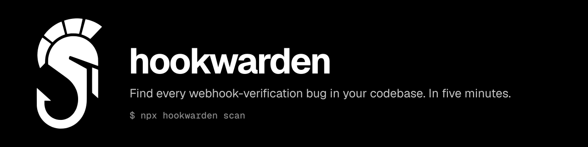

<p align="center">
  
</p>

Webhook security audit CLI. Find every webhook-verification bug in your codebase. License: Apache 2.0.

```sh
npx hookwarden scan
```

Installation and usage docs land at https://hookwarden.dev once the project is publicly launched.

Brand assets and the canonical mark live at [`assets/brand/`](./assets/brand/).
